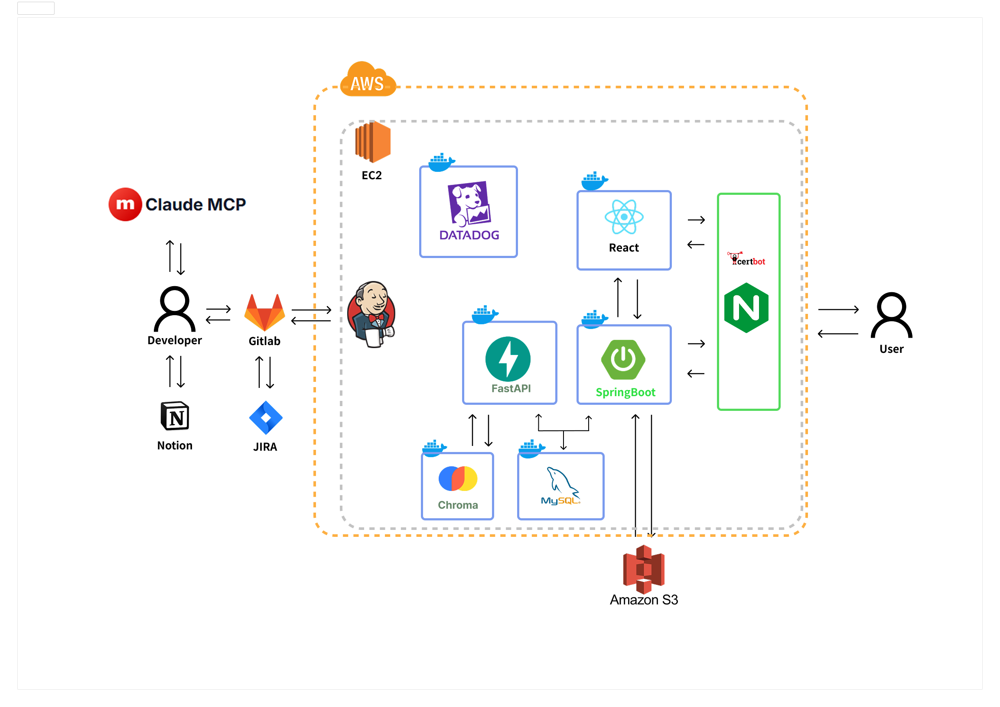
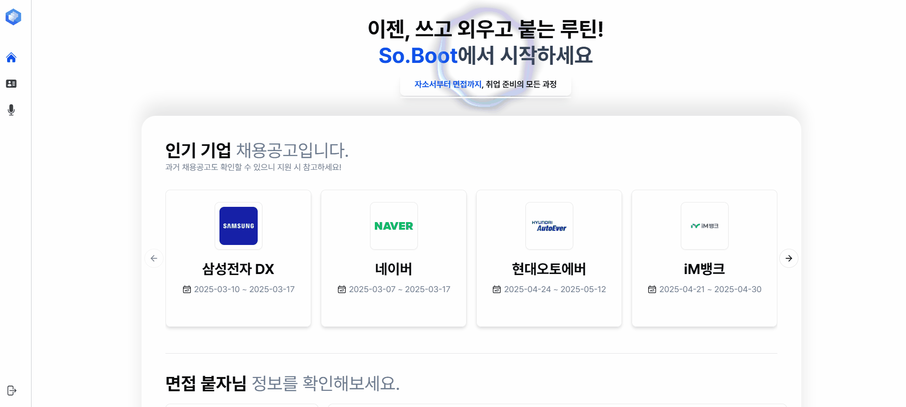
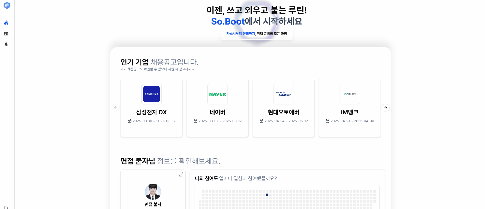
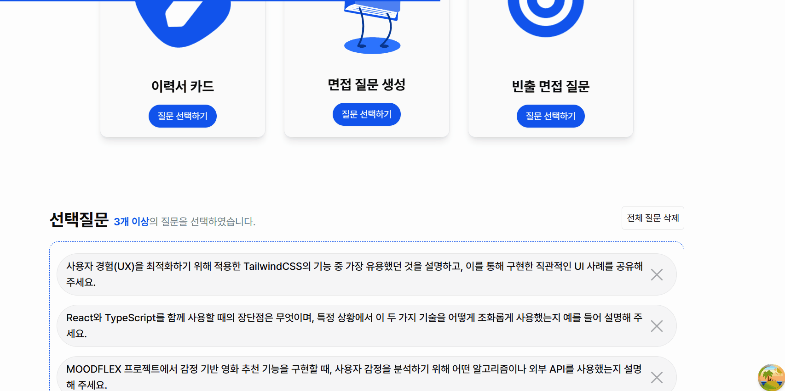
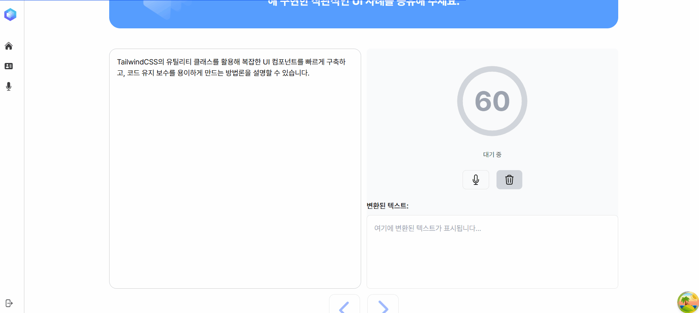

# 🐔 TEAM 당신은 취업이 땡긴다 "서류는 붙었는데...(So.Boot)"

## SSAFY 12기 자율프로젝트

> **서류는 붙었는데 면접이 두렵다면?**
>
> **면접 3단계 준비 기반 맞춤형 면접 연습 플랫폼 So.Boot!**

- [🌐 So.Boot 서비스 바로가기](https://soboot.co.kr/)
- [🎞 So.Boot 영상 포트폴리오](https://youtu.be/_rrNUo6yius)
- [📌 So.Boot PPT](https://www.figma.com/deck/wcgWgt6FAvZF7l599ZJUUP/So.Boot-%EC%B5%9C%EC%A2%85%EB%B0%9C%ED%91%9C?node-id=1-983&t=SbnpmcBXm8KtsTVt-1)

## 📑 목차

1. [📋 프로젝트 소개](#-프로젝트-소개)
2. [🚀 주요 기능](#-주요-기능)
3. [🔬 주요 기술](#-주요-기술)
4. [🛠️ 기술 스택](#-기술-스택)
5. [📂 프로젝트 구조](#-프로젝트-구조)
6. [👨‍👩‍👧‍👦 팀원 정보](#-팀원-정보)
7. [📌 기타 정보](#-기타-정보)

---

## 📋 프로젝트 소개

- 스크립트 → 키워드 → 암기 순의 체계적 면접 리허설
- 업로드한 이력서 PDF 기반의 맞춤형 질문 제공
- 기업별 자소서/면접 질문 제공으로 실전 감각 강화
- AI 피드백과 실시간 힌트로 반복 학습 지원
- 활동 내역 시각화로 꾸준한 취업 루틴 관리 가능

---

## 🚀 주요 기능

1. **3단계 답변 리허설 시스템**

- 스크립트 → 키워드 → 암기 순의 체계적 연습 프로세스
- 사용자 답변 완성도를 점진적으로 향상시킬 수 있도록 구성
- 반복 연습 및 힌트 제공 기능으로 자기주도 학습 강화
- 3단계 리허설에서는 웹캠으로 자신의 모습을 확인하며 실전 면접 연습

2. **제출한 이력서 PDF 기반 질문 제공**

- 업로드한 이력서 내용을 분석해 맞춤형 질문 자동 생성
- 경력·경험 기반 심층 질문으로 실전 감각 강화
- 불명확한 이력 정보에 대한 보완 피드백 제공

3. **기업별 자소서 및 면접 질문 제공**

- 사용자가 선택한 기업에 맞는 실제 채용 문항 제공
- 기업/직무별 맞춤 자소서 작성과 면접 질문 연습 가능
- 작성한 자소서 기반으로 이력서 자동 생성 연계

4. **빈출 질문 제공**

- 직무·산업군별 실제 자주 나오는 면접 질문 데이터 제공
- 기본형·심화형으로 구성된 질문으로 단계별 연습 가능
- 빈출 질문에 대한 AI 피드백 및 개선 힌트 지원

5. **시각화 기반 취업 스트릭 관리**

- GitHub 잔디처럼 자소서, 면접 연습, 블로그 활동 등을 시각화
- 꾸준한 활동 내역을 한눈에 파악 가능
- 사용자의 취업 루틴 관리 및 성취감 기반 동기 부여 제공

## 🔬 주요 기술

1. **Datadog 기반 통합 모니터링**

- Datadog을 통해 전체 서비스 상태를 모니터링하며 실시간 에러 및 성능 이슈 추적
- 면접 녹음 처리, AI 응답 속도, 자소서 저장 요청 등 주요 이벤트를 APM으로 세분화
- 로그/지표/트레이스 통합 관리를 통해 병목 구간 탐지 및 사용자 불편 최소화

2. **OCR 기반 PDF 텍스트 추출**

- 사용자가 PDF형태의 자기소개서 문서 업로드
- Tesseract OCR 엔진을 활용한 텍스트 추출
- 한글 문자 인식 최적화

3. **Web Speech API 음성 인식 기능**

- Web Speech API의 SpeechRecognition을 활용하여 사용자의 면접 답변을 실시간으로 텍스트화
- 사용자가 말한 면접 답변을 즉시 화면에 텍스트로 표시하여 자기 피드백 가능
- 음성으로 대답한 내용을 기록하고 검토할 수 있는 기능 제공

### AI 기술

1. **AI 자기소개서 분석 기능**

- OCR로 추출한 텍스트에서 ChatGPT API를 활용하여 문항과 답변 자동 분리
- ChatGPT API를 활용한 자기소개서 내용 분석
- 핵심 키워드 및 주요 역량 추출
- 답변의 강점과 개선점 제안

2. **개발자 면접 질문 생성 및 답변 추천 RAG 시스템**

- LLM과 RAG(Retrieval-Augmented Generation) 기술을 활용한 맞춤형 면접 질문 생성
- 기존 면접 질문 데이터를 벡터 데이터베이스에 저장하고, 사용자 요청에 따라 관련 질문 검색
- 검색된 질문을 바탕으로 새로운 맞춤형 질문 자동 생성
- 생성된 전체 질문을 바탕으로 최적의 답변 추천 기능 제공

---

## 🛠️ 기술 스택

### 💻 프론트엔드


### ⚙️ 백엔드


### 🗄️ 데이터베이스


### ☁️ 인프라


### 👊 협업 툴


### ✍️ IDE & 편집툴


---

## 📂 프로젝트 구조

### 📦 프론트엔드

```
src/
├── api/ # API 관련 로직
│ └── instance/ # 인스턴스 설정
├── assets/ # 정적 파일 (빌드 시 번들링됨)
│ ├── images/ # 이미지 파일 (PNG, JPG, SVG 등)
│ ├── fonts/ # 폰트 파일
│ ├── lottie/ # Lottie 애니메이션 JSON 파일
│ └── mocks/ # 목업 데이터 (개발용 더미 데이터)
├── components/ # 재사용 가능한 컴포넌트
│ ├── common/ # 공통 컴포넌트
│ └── ui/ # React UI 컴포넌트 라이브러리 (shadcn/ui, react-bits)
├── hooks/ # 커스텀 훅 (use~)
├── layouts/ # 레이아웃 컴포넌트
├── lib/ # 외부 라이브러리 관련 유틸
├── routes/ # 라우트 설정
│ ├── pages/ # 페이지 컴포넌트
│ ├── index.tsx # 최상위 라우트 설정 (RouterProvider 등)
│ └── router.tsx # 개별 라우트 정의 (라우트 목록)
├── store/ # 상태 관리 (Zustand)
├── styles/ # 전역 스타일
│ └── index.css
└── utils/ # 유틸리티 함수 (only js, ts)

public/ # 정적 파일 (빌드 시 그대로 복사됨)
├── index.html # HTML 템플릿
├── favicon.ico # 파비콘
├── robots.txt # 검색 엔진 크롤링 설정
└── manifest.json # PWA 설정

```

### 🖥️ 백엔드

1. Spring Boot

```

src
├─main
│ └─com
│ └─so_boot
│ ├─domain
│ │ ├─auth
│ │ │ ├─controller
│ │ │ ├─filter
│ │ │ ├─model
│ │ │ │ ├─dto
│ │ │ │ └─entity
│ │ │ ├─repository
│ │ │ ├─service
│ │ │ └─util
│ │ ├─company
│ │ │ ├─controller
│ │ │ ├─model
│ │ │ │ ├─dto
│ │ │ │ └─entity
│ │ │ ├─repository
│ │ │ └─service
│ │ ├─member
│ │ │ ├─controller
│ │ │ ├─model
│ │ │ │ ├─dto
│ │ │ │ └─entity
│ │ │ ├─repository
│ │ │ └─service
│ │ ├─question
│ │ │ ├─controller
│ │ │ ├─model
│ │ │ │ ├─dto
│ │ │ │ └─entity
│ │ │ ├─repository
│ │ │ └─service
│ │ └─rehearsal
│ │ ├─controller
│ │ ├─model
│ │ │ ├─dto
│ │ │ └─entity
│ │ ├─repository
│ │ └─service
│ └─global
│ ├─config
│ ├─exception
│ ├─handler
│ ├─model
│ │ ├─dto
│ │ ├─entity
│ │ └─enums
│ └─service

```

2. FastAPI

```

app
├── api
│ └── endpoints
├── core
├── db
├── models
└── services

```

### 🏗️ 아키텍처



### 📚 ERD


---

## 👨‍👩‍👧‍👦 팀원 정보

| 🧑‍💻**이름** | 🏆**역할**                  | 🚀**이메일주소**     |
| ---------- | --------------------------- | -------------------- |
| **우정훈** | 팀장, 프론트엔드, PM 담당   | hoonixox@naver.com   |
| **권상웅** | 프론트엔드 개발자           | ssafywoong@gmail.com |
| **우준규** | 프론트엔드 개발자, 디자이너 | dnwnsrb11@naver.com  |
| **배준영** | 백엔드 팀장, AI 담당        | bjy556@naver.com     |
| **경이현** | 백엔드 개발자               | wm0755123@gmail.com  |
| **김승준** | 백엔드 개발자, 인프라       | zzjoon97@naver.com   |

---

## 🛠 담당 파트

### 우정훈

- **프론트엔드 개발**
  - **사용자 인증 및 계정 관리 구현**
  - **프로필 페이지 개발**
    - REST API를 통한 프로필 페이지 구현
  - **프로젝트 초기 세팅 및 아키텍처 구성**
    - 폴더 구조 및 프로젝트 설정으로 모듈화와 재사용성을 고려한 클린 아키텍처 설계
    - React Query 도입으로 데이터 페칭, 캐싱, 동기화 관리로 효율적인 상태관리 구현
    - shadcn/ui, react-bits, aceternity 등 최신 UI 컴포넌트 라이브러리 적용 및 사용법 공유
    - Prettier, ESLint 설정을 통한 코드 일관성 확보 및 스타일 관리
  - **추가 기술 스택 및 도구**
    - 빌드 및 번들러로 pnpm, Vite 등 최신 프론트엔드 도구 활용
- **PM**
  - **Agile 기반의 프로젝트 기획 및 일정 관리**
    - 스프린트 및 칸반 보드를 활용한 업무 우선순위 설정 및 진행 상황 시각화
    - 프로젝트 전체 일정 수립 및 팀원 업무 분배
  - **도구를 활용한 협업 및 커뮤니케이션 최적화**
    - Jira를 통한 이슈 및 일정 관리, GitLab과 연동하여 개발과 관리 간의 원활한 연결 유지
    - Mattermost와 GitLab CI/CD 연동으로 커밋 알림 및 실시간 코드 변경사항 공유
    - Notion 기반의 프로젝트 문서화 및 회의록 공유 시스템 운영
  - **품질 유지와 코드 협업 문화 구축**
    - 팀 전체 Git 전략 수립 (Git Flow) 및 PR 리뷰 가이드라인 정의

### 권상웅

- **프론트엔드 개발**
  - **페이지 구현**
    - 사용자 인증 관련 페이지(로그인, 로그아웃, 회원가입) 구현 및 Auth API 연동
    - 회원정보 조회 및 수정 페이지 구현 및 Member API 연동
    - 이력서 업로드 및 관리 페이지 구현과 파일 업로드 기능 연동
- **백엔드 개발**
  - **SSAFY OAUTH 로그인 구현**

### 우준규

- **프론트엔드 개발**
  - 면접 리허설 기능 개발
    - Web Speech API 기반 실시간 Speech to Text 구현
    - 음성 인식 결과 UI 연동 및 출력 최적화
    - 면접 단계/타이머/응답 기록 등 상태 관리 구조 설계
    - Zustand 기반 글로벌 상태 모듈화 및 selector 최적화
  - 전반적인 기능 테스트 및 디버깅, 사용자 흐름 고려한 인터랙션 개선
- **디자인**
  - **서비스 전체 UX/UI 디자인 총괄**
    - 메인페이지, 로그인/회원가입, 면접 리허설 등 전반적 화면 설계
    - 사용자 심리 고려한 톤앤매너 및 컬러 시스템 기획
    - Figma 기반 와이어프레임 및 프로토타입 제작

### 배준영

- **백엔드 개발**
  - **질문/답변 관리 API 개발**
    - COMMON, CUSTOM, C_LETTER 세 가지 질문 유형 관리 시스템 구현
    - 요청 파라미터 type에 따른 질문 목록 필터링 로직 개발
    - 질문-답변 연결 구조 설계 및 조회 기능 구현
  - **리허설(모의면접) API 개발**
    - 모의면접 결과 생성, 조회, 삭제 API 구현
    - 질문별 피드백 및 모범 답안 관리 기능 구현
- **AI 개발**
  - **RAG 기반 면접 질문 및 평가 시스템 개발**
    - **공통 RAG 구축**
      - ChromaDB 벡터 저장소를 활용한 데이터 임베딩 및 검색 구현
      - CS 지식 데이터베이스 구축 및 검색 메커니즘 설계
      - 메타데이터 기반 필터링과 벡터 유사도 검색의 하이브리드 검색 시스템 개발
      - GMS 프록시 기반 OpenAI API 연동 아키텍처 설계
    - **자소서 기반 맞춤형 면접 질문 자동 생성**
      - 자소서 데이터의 효과적인 청킹 전략 설계 및 적용
      - 벡터 DB 기반 기술 면접 질문 강화 메커니즘 구현
    - **답변 평가 및 피드백**
      - 내용 적합성, 전문성, 직무 적합성 평가 시스템 설계
      - LLM 활용 모범 답안 및 맞춤형 피드백 생성 기능 구현
      - 검색된 지식 기반 답변 정확성 평가 로직 개발
      - 평가 점수 계산 및 결과 저장 로직 개발

### 경이현

- **백엔드 개발**
  - **JWT 기반 인증 및 인가 구현**
    - Spring Security와 JWT를 활용한 사용자 인증 및 인가 로직 구현
    - Access/Refresh Token 방식을 통해 보안성과 재로그인 편의성 확보
  - **S3 기반 PDF 업로드 기능 개발**
    - 사용자가 업로드한 자소서 PDF 파일을 AWS S3에 저장하는 기능 구현
    - MultipartFile 처리 및 UUID 기반 파일명 생성 로직 적용
  - **이력서 업로드/조회 API 개발**
    - 사용자 이력서를 업로드하고 조회할 수 있는 RESTful API 구현
    - 사용자별 이력서 관리 기능 제공
  - **OCR 기반 자소서 분석 자동화**
    - 업로드된 자소서를 Tesseract OCR로 텍스트 추출
    - 추출한 텍스트를 OpenAI(ChatGPT) API에 전달하여 질문/답변 형식으로 자동 분리
  - **멀티스레딩 기반 OCR 속도 개선**
    - 다중 페이지 PDF의 OCR 병목 문제 해결을 위해 멀티스레딩 구조 적용
    - 각 페이지마다 독립적인 Tesseract 인스턴스를 생성하여 병렬 처리 수행
    - 1MB 기준 OCR 처리 시간 약 1분 20초 → 50초로 약 38% 성능 개선

### 김승준

- **인프라 구축 및 관리**
  - **Docker 기반 멀티 컨테이너 아키텍처 설계 및 구현**
    - Spring Boot, React/nginx, MySQL, FastAPI, Redis, Datadog Agent 컨테이너 구성
    - 컨테이너 간 네트워크 구성 및 서비스 간 통신 최적화
  - **Nginx 리버스 프록시 설정**
    - HTTP→HTTPS 리디렉션 및 Let's Encrypt 인증서 관리
    - 멀티 서비스 라우팅 및 통합 프록시 설정
  - **모니터링 시스템 구축**
    - Datadog Agent를 통한 메트릭·로그 수집 자동화
    - 컨테이너 stdout/stderr 로그 자동 수집 및 에이전트 자체 로그 필터링
    - Live Tail·Explorer 필터링, 대시보드·Saved View 구성
  - **CI/CD 파이프라인 통합**
    - Jenkins 연동을 위한 Nginx 프록시 설정
    - docker-compose를 이용한 컨테이너 이미지 빌드 및 배포 자동화
- **백엔드 개발**
  - **답변 키워드 추출 기능**
    - 면접 질문에 대한 유저 답변에서 핵심 키워드 자동 추출
    - ChatGPT o3-mini 모델 활용
  - **채용 문항 및 자료 수집**
    - 채용 관련 질문 및 정보 크롤링
    - 수집된 데이터를 AWS S3에 자동으로 업로드
  - **AI 기반 답변 툴팁 제공**
    - 면접 질문에 대해 AI가 답변 팁 제공

### 공통 파트

- **기획, 요구사항 명세서, ERD구성, API 명세서**

---

## 기능 시연

### 홈



### 기업 채용공고


### 이력서 업로드



### 면접 리허설





### 면접 리허설 결과 확인


---

## 📌 기타 정보

- **CI/CD:** GitLab, Jenkins를 활용한 자동화 배포
- **테스트 방법:** QA 문서 작성 후 페이지별 테스트 진행
